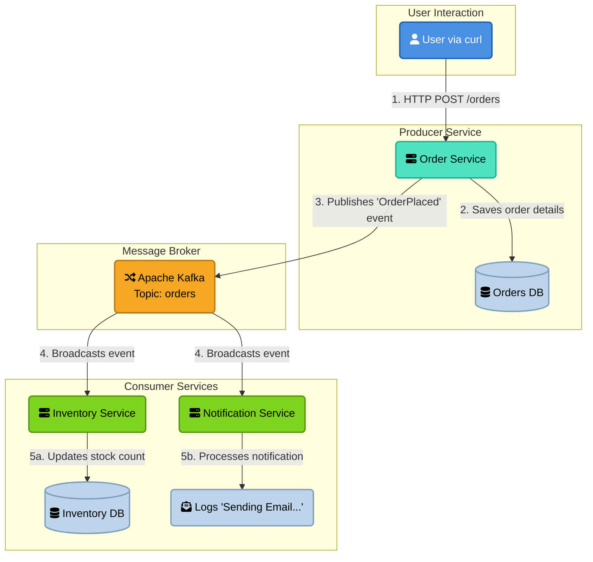

# Kafka - Proof of Concept

### Architecture diagram:



### Prerequisites 
- Java 21
- Docker
- (recommended) InteliJ or some other IDE

### Running the project
- inside project folder run `docker compose up` to run Kafka in Docker container
- run all services (`order-service`, `notification-service`, `inventory-service`)

<br>

- to send new message to Kafka topic (example request):
  - **POST** `localhost:8080/api/orders`

    ```json
    {
      "orderId": 9,
      "productName": "Logitec MX Keys",
      "quantity": 2,
      "price": 100.50
    }